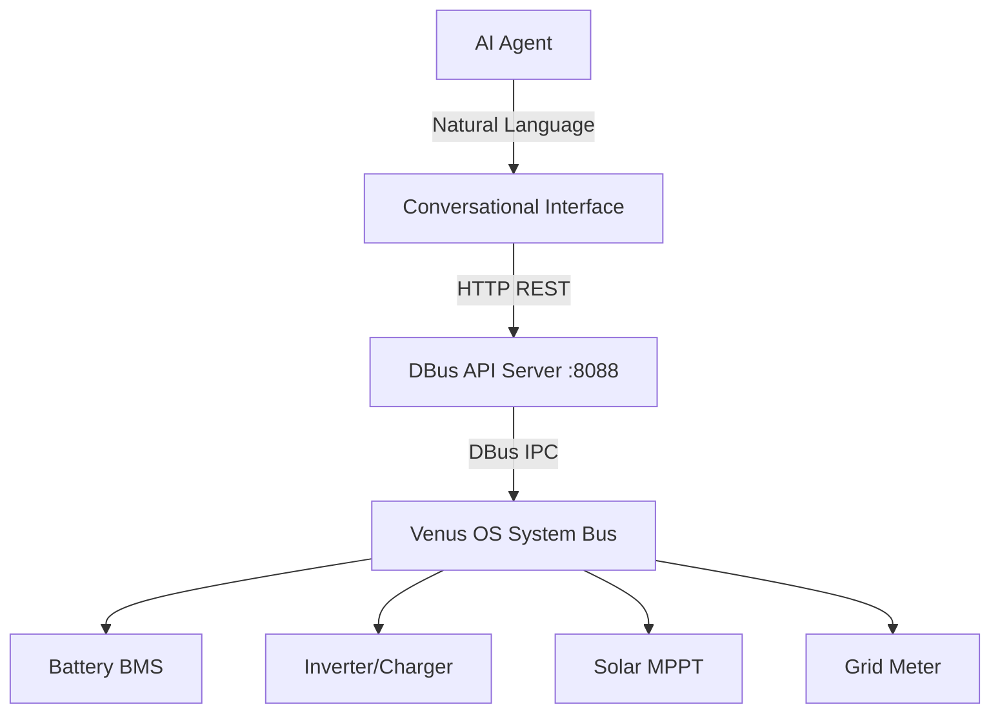

# Repository Beautification & Improvement Suggestions

Comprehensive suggestions for enhancing the Victron DBus API repository.

---

## ✅ Completed

### Sponsorship & Funding
- ✅ Added `.github/FUNDING.yml` with Buy Me a Coffee link
- ✅ "Sponsor" button now appears on GitHub repo

### Documentation Structure
- ✅ Diataxis framework implementation
- ✅ Persona-based organization (Mauk + Installer)
- ✅ 60+ focused guides (100-500 lines each)
- ✅ Zero broken links
- ✅ Made in Ukraine footer on all docs

### Contributing
- ✅ CONTRIBUTING.md with clear guidelines
- ✅ Issue templates (bug report, feature request, documentation)
- ✅ Contribution workflow documented

---

## 🎨 Visual Enhancements (Recommended)

### Additional Badges for README

Add to README.md header:
```markdown
[](https://github.com/EnergyCitizen/victron_dbus_api/graphs/contributors)
[](https://github.com/EnergyCitizen/victron_dbus_api/issues)
[](https://github.com/EnergyCitizen/victron_dbus_api/pulls)
[](https://github.com/EnergyCitizen/victron_dbus_api/commits/main)
[](https://github.com/EnergyCitizen/victron_dbus_api/stargazers)
```

### Social Preview Image

Create `.github/social-preview.png`:
- Size: 1280x640px
- Content: "Victron DBus API for AI Agents" + diagram
- Upload in GitHub repo settings → Social Preview

### Repository Topics

Add GitHub topics (Settings → Topics):
```
victron-energy
venus-os
dbus-api
ai-agents
iot-monitoring
solar-monitoring
battery-management
energy-storage
home-automation
python-api
```

---

## 📚 Documentation Enhancements

### Add Visual Diagrams

**System Architecture Diagram**:


**Data Flow Diagram** for fleet monitoring
**Troubleshooting Decision Tree** visual

### Interactive Examples

Add to key tutorials:
- **Jupyter Notebooks**: Interactive Python examples
- **Postman Collection**: Import API endpoints
- **Docker Container**: Run API server locally for testing

### Video Walkthroughs

Record screencasts:
1. "Install API server in 2 minutes"
2. "Build first monitoring agent (Tutorial 01)"
3. "Diagnose battery not charging remotely"

Host on YouTube, embed in docs.

---

## 🛠️ Technical Improvements

### API Server Enhancements

**Add Features**:
```python
# Batch queries (reduce round trips)
GET /batch?queries=[{service:X,path:Y},{service:Z,path:W}]

# Subscribe to changes (WebSocket)
WS /subscribe?service=X&path=Y&interval=5

# Historical data (if Venus OS logs available)
GET /history?service=X&path=Y&from=2025-10-01&to=2025-10-23

# Health endpoint with metrics
GET /health/metrics
# Response: uptime, query count, error rate, etc.
```

**Performance**:
- Connection pooling for DBus
- Response caching (5-60 second TTL)
- gzip compression
- Request rate limiting

**Security** (for production):
- API key authentication
- HTTPS/TLS support
- CORS configuration
- Request logging

### Python Scripts Improvements

**discover_device_ids.py**:
- Add `--output-format` (json/yaml/csv)
- Export to InfluxDB line protocol
- Device topology visualization (ASCII art)

**get_voltage_info.py**:
- Real-time updates (watch mode)
- Voltage deviation alerts
- Export to Grafana dashboard JSON

### Development Tools

**Docker Support**:
```dockerfile
# Dockerfile for API server
FROM python:3.9-slim
RUN pip install dbus-python
COPY dbus_api_server.py /app/
CMD ["python3", "/app/dbus_api_server.py"]
```

**GitHub Actions**:
```yaml
# .github/workflows/test.yml
- Test documentation links
- Validate markdown format
- Check Python syntax
- Test API on Venus OS simulator
```

---

## 📱 Community & Ecosystem

### GitHub Features

**Enable**:
- ✅ GitHub Discussions (Q&A, Ideas, Show & Tell)
- ✅ GitHub Wiki (Community-contributed guides)
- ✅ GitHub Projects (Roadmap, Feature tracking)
- ✅ Sponsor button (already done)

**Create**:
- Roadmap project board
- "Good First Issue" labels
- "Help Wanted" tags for community contributions

### Community Building

**Create**:
- Discord/Slack channel for real-time help
- Monthly community call (share use cases)
- Showcase: User stories from Mauk, installers
- Blog: Technical deep dives

**Partner With**:
- El Niño: Official AI ecosystem collaboration
- Victron Community: Cross-promotion
- Home Assistant: Integration guide
- Node-RED: Flow examples

---

## 🚀 Feature Roadmap

### Q1 2026: Enhanced Monitoring

- [ ] WebSocket support for real-time updates
- [ ] Historical data queries (if Venus OS logs available)
- [ ] Batch query endpoint (reduce API calls)
- [ ] Performance metrics and health monitoring

### Q2 2026: VRM Integration

- [ ] Work with Victron on ProxyRelay integration
- [ ] VRM API authentication proof-of-concept
- [ ] Auto-discovery via VRM portal
- [ ] Caching layer for scalability

### Q3 2026: AI Agent Ecosystem

- [ ] Pre-built agent templates (battery, solar, grid)
- [ ] Agent marketplace (share/sell agents)
- [ ] Multi-agent collaboration patterns
- [ ] Integration with popular AI frameworks

### Q4 2026: Advanced Features

- [ ] Predictive maintenance ML models
- [ ] Automated optimization recommendations
- [ ] Fleet benchmarking and best practices
- [ ] Integration with energy trading platforms

---

## 📊 Analytics & Metrics

### Add to Repository

**GitHub Insights**:
- Enable traffic analytics
- Track documentation page views
- Monitor clone/fork activity

**Documentation Analytics**:
- Which guides are most visited
- Which personas use the docs more
- Common search queries (if wiki enabled)

**API Usage Metrics** (if centralized deployment):
- Most queried DBus paths
- Average response times
- Error rate by endpoint

---

## 🌍 Internationalization

### Multi-Language Support

**Priority Languages** (Victron market presence):
1. **English** (current, complete)
2. **German** (DACH region, large Victron market)
3. **Dutch** (Victron HQ, Netherlands)
4. **French** (Belgium, France, Africa)
5. **Spanish** (Latin America, Spain)
6. **Ukrainian** (EnergyCitizen, solidarity)

**Structure**:
```
docs/
├── en/ (English - default)
├── de/ (German)
├── nl/ (Dutch)
├── fr/ (French)
└── uk/ (Ukrainian)
```

**Automation**: Use Crowdin or Weblate for community translation.

---

## 🔐 Security & Compliance

### Security Enhancements

**Add**:
- SECURITY.md with vulnerability reporting process
- Dependabot for Python dependency updates
- Security scanning (Snyk, GitHub Security)
- Code signing for releases

**Document**:
- Security best practices for API deployment
- Network isolation recommendations
- VPN setup guide for remote access

### Compliance

**For Enterprise Users**:
- GDPR compliance notes (data collection)
- SOC 2 readiness guide
- Audit logging documentation

---

## 📦 Distribution & Packaging

### Make It Easier to Install

**PyPI Package**:
```bash
pip install victron-dbus-api
victron-api-server --port 8088
```

**Docker Hub**:
```bash
docker pull energycitizen/victron-dbus-api
docker run -p 8088:8088 victron-dbus-api
```

**Venus OS Package**:
- Submit to Victron package repository
- One-click install from Venus OS GUI
- Auto-start on boot

**Homebrew** (for development):
```bash
brew install victron-dbus-api
```

---

## 🎓 Educational Content

### Webinars & Workshops

**For AI Developers**:
- "Building Your First Victron Monitoring Agent" (1 hour)
- "Fleet Management with AI Agents" (2 hours)
- "Predictive Maintenance Deep Dive" (3 hours)

**For Installers**:
- "Remote Troubleshooting with AI" (1 hour)
- "Installation Validation Best Practices" (1 hour)

### Certification Program

**Victron AI Agent Developer Certification**:
- Complete all 4 tutorials
- Build and deploy fleet monitoring agent
- Pass assessment (build agent for given scenario)
- Certificate: "Certified Victron AI Agent Developer"

---

## 💼 Business Development

### Partnerships

**El Niño (Mauk)**:
- Official AI ecosystem partnership announcement
- Co-marketing: Case studies, webinars
- Beta access to VRM ProxyRelay integration

**Victron Energy**:
- Proposal: Integrate API into Venus OS core
- Technical collaboration on ProxyRelay
- Featured in Victron Professional newsletter

**Integration Partners**:
- Home Assistant: Official integration
- Node-RED: Flow library with examples
- Grafana: Dashboard templates
- InfluxDB: Time-series storage guide

### Monetization (Optional)

**Free Tier**:
- API server (open source)
- Documentation
- Community support

**Pro Tier** (if VRM integrates):
- VRM ProxyRelay access
- Advanced analytics
- Priority support
- SLA guarantees

---

## 📈 Growth Metrics

### Track Success

**Documentation Metrics**:
- GitHub stars and forks
- Tutorial completion rate
- Community contributions
- Issue resolution time

**Adoption Metrics**:
- API server deployments (telemetry opt-in)
- Active AI agent developers
- Installer tool usage
- Fleet size monitored

**Business Metrics**:
- Maintenance cost savings (tracked by users)
- Truck rolls prevented
- Early battery replacement detections
- Uptime improvements

---

## 🎯 Quick Wins (Implement First)

### High Impact, Low Effort

1. **Add badges to README** (10 min)
   - Contributors, issues, last commit, stars

2. **Enable GitHub Discussions** (5 min)
   - Q&A section
   - Show & Tell for agent implementations

3. **Create .gitignore** (5 min)
   - Exclude *.json (example outputs)
   - Exclude .DS_Store, __pycache__, etc.

4. **Add CHANGELOG.md** (15 min)
   - Document version history
   - Link to releases

5. **Create GitHub Release** (10 min)
   - Tag v2.0.0 (Diataxis restructure)
   - Release notes
   - Downloadable assets

6. **Add more mermaid diagrams** (30 min)
   - System architecture in README
   - Troubleshooting decision trees
   - Data flow diagrams

---

## 🔮 Future Vision

### Long-Term Opportunities

**Victron Integration**:
- Venus OS core feature (built-in API)
- VRM ProxyRelay REST endpoints
- Official Victron AI platform

**AI Ecosystem**:
- Agent marketplace
- Pre-trained models for diagnostics
- Multi-vendor support (SMA, Fronius, etc.)

**Enterprise Features**:
- Multi-tenancy for installers
- White-label solutions
- SLA monitoring and reporting

---

## 📝 Implementation Priority

### Phase 1: Quick Wins (Week 1)
- [x] Sponsorship button
- [x] CONTRIBUTING.md
- [x] Issue templates
- [ ] Add more badges
- [ ] Enable GitHub Discussions
- [ ] Create .gitignore
- [ ] Add CHANGELOG.md

### Phase 2: Community (Week 2-4)
- [ ] GitHub Projects roadmap
- [ ] Good First Issue tags
- [ ] Community showcase
- [ ] Video tutorials

### Phase 3: Technical (Month 2-3)
- [ ] WebSocket support
- [ ] Batch queries
- [ ] Performance optimization
- [ ] Docker packaging

### Phase 4: Ecosystem (Month 4-6)
- [ ] Home Assistant integration
- [ ] Grafana dashboards
- [ ] Partner announcements
- [ ] Certification program

---

**Prepared by**: EnergyCitizen team
**Review**: Which improvements should we prioritize?

---

**Made in Ukraine 🇺🇦 with love by EnergyCitizen**
