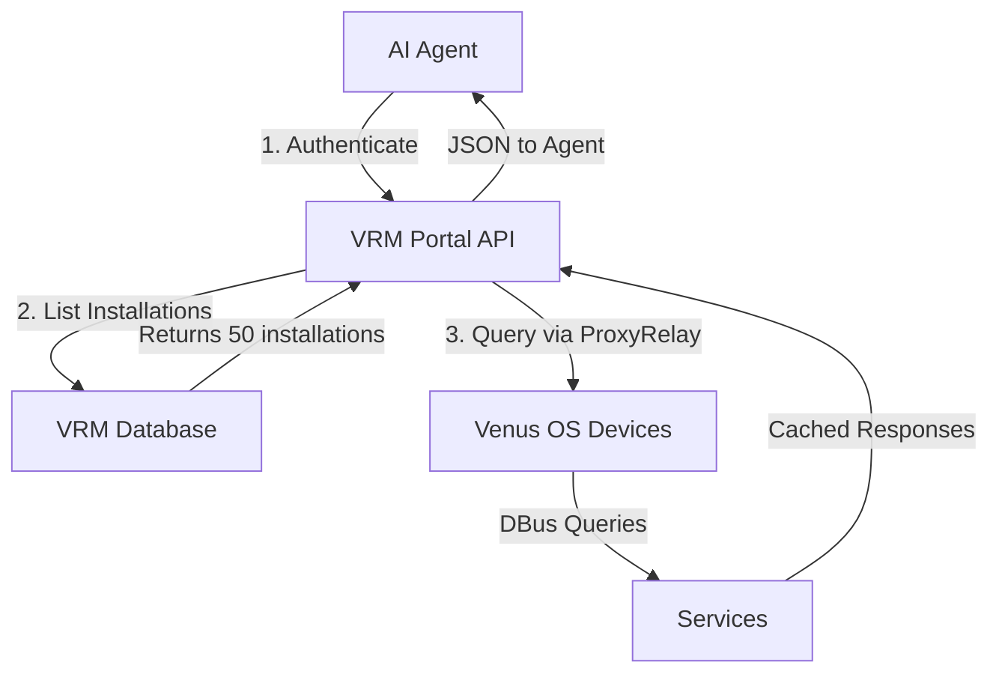

# Victron DBus API for AI Agents

[](https://github.com/vshymanskyy/StandWithUkraine/blob/main/docs/README.md)

[](LICENSE)
[](https://python.org)
[](https://github.com/victronenergy/venus)

> Read-only HTTP REST API server for Victron Venus OS devices, enabling AI agents to monitor and diagnose solar/battery systems at scale.

---

## 👤 Who Are You?

<table>
<tr>
<td width="50%">

### 🤖 AI Agent Developer

**You are**: Mauk Muller (or similar)
**Company**: El Niño, building AI monitoring solutions
**Goal**: Build conversational agents for Victron fleet monitoring

**Your Question**:
> "How do I build an AI agent that monitors 50+ VRM installations and detects battery issues automatically?"

**Start Here** → [AI Agent Developer Docs](docs/ai-agent-developer/)

**Quick Links**:
- [Tutorial: First Monitoring Agent](docs/ai-agent-developer/tutorials/01-first-monitoring-agent.md) (30 min)
- [How-To: Detect Battery Degradation](docs/ai-agent-developer/how-to-guides/anomaly-detection/detect-battery-degradation.md)
- [How-To: Natural Language Queries](docs/ai-agent-developer/how-to-guides/conversational-patterns/natural-language-queries.md)

</td>
<td width="50%">

### 🔧 Victron Installer/Maintainer

**You are**: Certified Victron installer
**Goal**: Troubleshoot remotely, validate installations quickly

**Your Question**:
> "Customer says battery not charging - how do I diagnose this remotely in 10 minutes?"

**Start Here** → [Installer Docs](docs/installer/)

**Quick Links**:
- [Tutorial: Validate Installation](docs/installer/tutorials/01-validate-new-installation.md) (20 min)
- [How-To: Battery Not Charging](docs/installer/how-to-guides/troubleshooting/battery-not-charging.md)
- [Reference: Troubleshooting Matrix](docs/installer/reference/troubleshooting-matrix.md)

</td>
</tr>
</table>

---

## What is This?

A Python-based HTTP API server that exposes Victron Venus OS (Cerbo GX, Venus GX) DBus system data via REST endpoints. Designed for **AI agents** and **fleet managers** to monitor multiple VRM installations remotely.

**Key Features:**
- 🔒 Read-only access (safe for production)
- 🚀 Lightweight (~200 lines Python, minimal dependencies)
- 📊 300+ diagnostic paths documented
- 🤖 AI-agent friendly JSON responses with conversational examples
- 🔌 Runs as daemon on Venus OS devices
- 💬 2025 UX: Natural language queries, proactive alerts, guided diagnosis

---

## 🚀 Quick Start

### Installation

```bash
# 1. Copy server to Venus OS device
scp dbus_api_server.py root@<DEVICE_IP>:~/

# 2. Start server
ssh root@<DEVICE_IP>
python3 dbus_api_server.py --port 8088 > dbus_api.log 2>&1 &

# 3. Verify
curl http://<DEVICE_IP>:8088/health
```

### Test Conversational Query

```bash
# Get battery level
curl "http://192.168.88.77:8088/value?service=com.victronenergy.battery.socketcan_can0&path=/Soc"

# Response:
{
  "service": "com.victronenergy.battery.socketcan_can0",
  "path": "/Soc",
  "value": 73.0,
  "success": true
}
```

**With AI Agent**:
```
User: "What's the battery level?"
Agent: "Battery is at 73%, discharging at 8A. About 5 hours remaining at current load."
```

---

## 📚 Documentation Structure

### By Persona

```
docs/
├── ai-agent-developer/     # For Mauk - Build AI monitoring agents
│   ├── tutorials/          # Learn step-by-step (30-120 min)
│   ├── how-to-guides/      # Solve specific problems (10-30 min)
│   ├── concepts/           # Understand "why" (15-25 min)
│   └── reference/          # Look up facts (2-5 min)
│
├── installer/              # For installers - Troubleshoot & validate
│   ├── tutorials/          # Learn workflows (15-30 min)
│   ├── how-to-guides/      # Fix specific issues (5-15 min)
│   ├── concepts/           # Understand systems (10-20 min)
│   └── reference/          # Quick lookup (2-5 min)
│
└── shared/                 # Common resources
    ├── architecture/       # System design
    ├── api-specification/  # HTTP API reference
    └── conversational-ai/  # 2025 UX patterns
```

---

## 🎯 Quick Access by Task

### I Want To...

#### Build AI Agents
- **First time?** → [Tutorial: First Monitoring Agent](docs/ai-agent-developer/tutorials/01-first-monitoring-agent.md)
- **Detect issues?** → [How-To: Detect Battery Degradation](docs/ai-agent-developer/how-to-guides/anomaly-detection/detect-battery-degradation.md)
- **Understand why?** → [Concept: Why Monitor Batteries](docs/ai-agent-developer/concepts/why-monitor-batteries.md)
- **Find API paths?** → [Reference: Critical Paths](docs/ai-agent-developer/reference/api/critical-paths.md)

#### Troubleshoot Systems
- **Validate install?** → [Tutorial: Validate Installation](docs/installer/tutorials/01-validate-new-installation.md)
- **Battery not charging?** → [How-To: Battery Not Charging](docs/installer/how-to-guides/troubleshooting/battery-not-charging.md)
- **Quick lookup?** → [Reference: Troubleshooting Matrix](docs/installer/reference/troubleshooting-matrix.md)

---

## 🔍 By Document Type (Diataxis)

### 🎓 Tutorials (Learning)

**Goal**: Learn by doing
**Time**: 30-120 minutes
**Format**: Step-by-step with working code

**For AI Developers**:
1. [Build First Monitoring Agent](docs/ai-agent-developer/tutorials/01-first-monitoring-agent.md) - 30 min
2. [Battery Health Agent](docs/ai-agent-developer/tutorials/02-battery-health-agent.md) - 60 min
3. [Fleet Dashboard Agent](docs/ai-agent-developer/tutorials/03-fleet-dashboard-agent.md) - 90 min
4. [Predictive Maintenance](docs/ai-agent-developer/tutorials/04-predictive-maintenance-agent.md) - 120 min

**For Installers**:
1. [Validate New Installation](docs/installer/tutorials/01-validate-new-installation.md) - 20 min
2. [Troubleshoot Remotely](docs/installer/tutorials/02-troubleshoot-remotely.md) - 30 min
3. [Compare Before/After](docs/installer/tutorials/03-compare-before-after.md) - 15 min

---

### 📋 How-To Guides (Tasks)

**Goal**: Solve specific problem
**Time**: 5-30 minutes
**Format**: User story → conversational flow → implementation

**Anomaly Detection**:
- [Detect Battery Degradation](docs/ai-agent-developer/how-to-guides/anomaly-detection/detect-battery-degradation.md)
- [Detect Grid Issues](docs/ai-agent-developer/how-to-guides/anomaly-detection/detect-grid-issues.md)
- [Detect Cell Imbalance](docs/ai-agent-developer/how-to-guides/anomaly-detection/detect-cell-imbalance.md)

**Troubleshooting**:
- [Battery Not Charging](docs/installer/how-to-guides/troubleshooting/battery-not-charging.md)
- [Grid Frequency Issues](docs/installer/how-to-guides/troubleshooting/grid-frequency-issues.md)
- [Inverter Load Imbalance](docs/installer/how-to-guides/troubleshooting/inverter-load-imbalance.md)
- [MPPT Offline](docs/installer/how-to-guides/troubleshooting/mppt-offline.md)

**Conversational Patterns**:
- [Natural Language Queries](docs/ai-agent-developer/how-to-guides/conversational-patterns/natural-language-queries.md)
- [Proactive Alerts](docs/ai-agent-developer/how-to-guides/conversational-patterns/proactive-alerts.md)
- [Explain System State](docs/ai-agent-developer/how-to-guides/conversational-patterns/explain-system-state.md)

---

### 💡 Concepts (Understanding)

**Goal**: Understand "why"
**Time**: 10-25 minutes

**For AI Developers**:
- [Why Monitor Batteries](docs/ai-agent-developer/concepts/why-monitor-batteries.md) - ROI, business value
- [Battery Degradation Patterns](docs/ai-agent-developer/concepts/battery-degradation-patterns.md) - Aging science
- [Inverter Load Balancing](docs/ai-agent-developer/concepts/inverter-load-balancing.md) - Sync mechanisms

**For Installers**:
- [Parallel Inverter Operation](docs/installer/concepts/parallel-inverter-operation.md) - How sync works
- [ESS Modes Explained](docs/installer/concepts/ess-modes-explained.md) - Mode 1 vs 3
- [DVCC Control System](docs/installer/concepts/dvcc-control-system.md) - Charge coordination

---

### 📚 Reference (Lookup)

**Goal**: Find specific information fast
**Time**: 2-5 minutes

- [Critical API Paths](docs/ai-agent-developer/reference/api/critical-paths.md) - Most important DBus paths
- [Battery Thresholds](docs/ai-agent-developer/reference/thresholds/battery-thresholds.md) - SOC, SOH, temp limits
- [Troubleshooting Matrix](docs/installer/reference/troubleshooting-matrix.md) - Quick diagnostic table
- [Alarm Codes](docs/installer/reference/alarm-codes.md) - Decode all alarms

---

## 💡 2025 AI Agent Pattern

**Old Way** (Python code):
```python
response = requests.get("http://192.168.88.77:8088/value",
                       params={"service": "com.victronenergy.battery.socketcan_can0",
                               "path": "/Soc"})
print(f"SOC: {response.json()['value']}%")
```

**New Way** (Conversational):
```
User: "What's the battery level at Site 3?"

Agent: "Site 3 battery is at 73%, charging at 15A.
        Should reach 90% in about 2 hours."
```

**Documentation Focus**: User stories and conversational flows, not just API calls.

---

## 📖 Learning Paths

### For Mauk (AI Developer)

**Week 1 - Beginner**:
1. [Tutorial 01: First Monitoring Agent](docs/ai-agent-developer/tutorials/01-first-monitoring-agent.md) (30 min)
2. [Concept: Why Monitor Batteries](docs/ai-agent-developer/concepts/why-monitor-batteries.md) (10 min)
3. [How-To: Natural Language Queries](docs/ai-agent-developer/how-to-guides/conversational-patterns/natural-language-queries.md) (20 min)

**Week 2 - Intermediate**:
4. [Tutorial 02: Battery Health Agent](docs/ai-agent-developer/tutorials/02-battery-health-agent.md) (60 min)
5. [How-To: Detect Battery Degradation](docs/ai-agent-developer/how-to-guides/anomaly-detection/detect-battery-degradation.md) (20 min)
6. [Concept: Battery Degradation Patterns](docs/ai-agent-developer/concepts/battery-degradation-patterns.md) (25 min)

**Week 3-4 - Advanced**:
7. [Tutorial 03: Fleet Dashboard](docs/ai-agent-developer/tutorials/03-fleet-dashboard-agent.md) (90 min)
8. [Tutorial 04: Predictive Maintenance](docs/ai-agent-developer/tutorials/04-predictive-maintenance-agent.md) (120 min)

### For Installer

**Quick Start** (1 hour):
1. [Tutorial: Validate Installation](docs/installer/tutorials/01-validate-new-installation.md) (20 min)
2. [How-To: Battery Not Charging](docs/installer/how-to-guides/troubleshooting/battery-not-charging.md) (15 min)
3. [How-To: Ask About System State](docs/installer/how-to-guides/conversational-queries/ask-about-system-state.md) (10 min)
4. [Reference: Troubleshooting Matrix](docs/installer/reference/troubleshooting-matrix.md) (5 min bookmark)

---

## 🌟 Featured Guides

### Most Popular

1. **[Detect Battery Degradation](docs/ai-agent-developer/how-to-guides/anomaly-detection/detect-battery-degradation.md)**
   - Save $30k/year by detecting aging early
   - Conversational proactive alerts
   - Predict replacement 3-6 months in advance

2. **[Battery Not Charging Troubleshooting](docs/installer/how-to-guides/troubleshooting/battery-not-charging.md)**
   - 5 common causes with AI-guided diagnosis
   - Resolve remotely in <15 minutes
   - 60% fewer truck rolls

3. **[Natural Language Queries](docs/ai-agent-developer/how-to-guides/conversational-patterns/natural-language-queries.md)**
   - 6 conversational patterns
   - Prompt engineering guide
   - Intent classification examples

---

## 🎓 What You'll Learn

### AI Agent Developers (Mauk)
- ✅ Build conversational monitoring agents (30 min tutorial)
- ✅ Implement natural language queries ("Show me battery health")
- ✅ Detect anomalies early (battery degradation, grid issues)
- ✅ Create proactive alerts (agent suggests actions)
- ✅ Predict failures 3-6 months in advance
- ✅ Monitor 50+ sites with fleet dashboard

### Victron Installers
- ✅ Diagnose issues remotely via AI agent
- ✅ Validate installations before leaving site (20 min checklist)
- ✅ Troubleshoot common problems (battery charging, load imbalance, MPPT offline)
- ✅ Compare system performance
- ✅ Understand "why" issues happen (not just how to fix)

---

## 📊 API Overview

### Key Endpoints

| Endpoint | Description | Example |
|----------|-------------|---------|
| `GET /services` | List all DBus services | 20 services on complex systems |
| `GET /value?service=X&path=Y` | Get specific metric | Battery SOC, grid power, solar yield |
| `GET /settings` | All system settings | 300+ configuration values |
| `GET /health` | API health check | Quick connection test |

### Common Services

| Service | What It Monitors |
|---------|------------------|
| `com.victronenergy.system` | System-level aggregates (SOC, power flows) |
| `com.victronenergy.battery.*` | Battery monitor (BMS data) |
| `com.victronenergy.vebus.*` | Multi/Quattro inverter/charger |
| `com.victronenergy.solarcharger.*` | MPPT solar controllers |
| `com.victronenergy.settings` | System configuration |

### Example: Battery Health Query

```bash
curl "http://192.168.88.77:8088/value?service=com.victronenergy.battery.socketcan_can0&path=/Soh"

# Response:
{
  "service": "com.victronenergy.battery.socketcan_can0",
  "path": "/Soh",
  "value": 96.0,
  "success": true
}
```

**With AI Agent**:
```
User: "How healthy is my battery?"
Agent: "Battery health is excellent at 96% SOH. It's aging normally (0.2%/month).
        No replacement needed for at least 5+ years."
```

---

## 🗺️ Documentation Map

### By Diataxis Type

| Type | Purpose | Time | Examples |
|------|---------|------|----------|
| **🎓 Tutorials** | Learn by doing | 30-120 min | Build first agent, Validate installation |
| **📋 How-To Guides** | Solve task | 10-30 min | Detect degradation, Fix charging |
| **💡 Concepts** | Understand "why" | 15-25 min | Battery aging, ESS optimization |
| **📚 Reference** | Look up facts | 2-5 min | API paths, Alarm codes, Thresholds |

### Core Documents

| Document | Description | Persona |
|----------|-------------|---------|
| [PERSONAS.md](PERSONAS.md) | Detailed persona profiles | Both |
| [AI Agent Developer Docs](docs/ai-agent-developer/) | Build conversational monitoring agents | Mauk |
| [Installer Docs](docs/installer/) | Troubleshoot and validate systems | Installer |
| [DOCS_RESTRUCTURE_PROPOSAL.md](DOCS_RESTRUCTURE_PROPOSAL.md) | How we organized this | Meta |

---

## 🎬 Example Scenarios

### For AI Developers (Mauk)

**Scenario**: Fleet battery health monitoring
```
User: "Check battery health across all my sites"

Agent: "Battery health summary across 12 sites:

HEALTHY (10 sites): SOC 60-95%, SOH 90-99%

WARNING (2 sites):
🟡 Site Alpha: SOH 82% (↓6% last month) → Replace in ~8 months
🟡 Site Beta: Cell spread 0.12V (imbalance developing)

CRITICAL (0 sites)

Estimated replacement costs: $15,000 (2 batteries)

Would you like details on the warning sites?"
```

**Guide**: [Detect Battery Degradation](docs/ai-agent-developer/how-to-guides/anomaly-detection/detect-battery-degradation.md)

---

### For Installers

**Scenario**: Remote diagnosis
```
Customer: "Battery not charging"

You Ask Agent: "What's wrong with Site 7?"

Agent: "I've diagnosed Site 7:

Current Status:
- Battery: 48.2V, 45% SOC
- Charge current: 0A (NOT charging)
- Inverter: Mode=On, State=Float
- AC Input: 228V (Grid OK)

Root Cause: ChargeBlocked alarm is ACTIVE

Reason: Battery temperature is 52°C, above the 50°C charge limit.
The BMS is blocking charging to protect cells from thermal damage.

Resolution:
- Wait for battery to cool below 45°C (check in 30 min)
- OR check cooling system (fan working? Ventilation OK?)
- System will resume charging automatically when temp drops

Shall I monitor temperature and notify when charging resumes?"
```

**Outcome**: Issue diagnosed in 30 seconds, no truck roll needed.

**Guide**: [Battery Not Charging](docs/installer/how-to-guides/troubleshooting/battery-not-charging.md)

---

## 🏗️ VRM ProxyRelay Vision

**Current**: Manual API server deployment on each Venus device
**Vision**: Victron integrates this into Venus OS core + VRM ProxyRelay

### Proposed Architecture



**Benefits**:
- **AI Developers**: Zero-friction deployment, VRM authentication, batch queries
- **Victron**: Enable AI ecosystem, competitive advantage, VRM Pro revenue
- **Installers**: Professional AI diagnostics out-of-the-box

**See**: [VRM ProxyRelay Vision](DOCS_RESTRUCTURE_PROPOSAL.md#vrm-proxyrelay-integration-vision) for full proposal

---

## 📝 Scripts Included

| Script | Purpose | Usage |
|--------|---------|-------|
| `dbus_api_server.py` | Main API server (read-only) | `python3 dbus_api_server.py --port 8088` |
| `discover_device_ids.py` | Device topology discovery | `python3 discover_device_ids.py` |
| `get_voltage_info.py` | Voltage monitoring (DC/AC) | `python3 get_voltage_info.py` |

---

## 🔬 Research Documentation

**Original technical research** (119KB, still available):
- [VICTRON_DBUS_DIAGNOSTIC_API_RESEARCH.md](VICTRON_DBUS_DIAGNOSTIC_API_RESEARCH.md) (47KB) - 300+ DBus paths
- [victron_einstein_research.md](victron_einstein_research.md) (38KB) - Multi-device system analysis
- [IMPLEMENTATION_GUIDE_AI_AGENTS.md](IMPLEMENTATION_GUIDE_AI_AGENTS.md) (20KB) - 8-week deployment
- [QUICK_REFERENCE_DIAGNOSTIC_PATHS.json](QUICK_REFERENCE_DIAGNOSTIC_PATHS.json) (14KB) - Machine-readable config

**New persona-based docs** are extracted and reorganized from these sources.

---

## 🤝 Contributing

We welcome contributions from:
- AI agent developers building on Victron platform
- Victron installers with field experience
- Venus OS developers
- Community members

**How to Contribute**:
1. Report issues via GitHub Issues
2. Improve documentation (fix typos, add examples)
3. Add diagnostic paths you've discovered
4. Share your AI agent or installer workflows

**Guidelines**: Test on real Venus OS devices, follow persona structure, no Claude credits (per NDA).

---

## 📄 License

**MIT License** - See [LICENSE](LICENSE)

**Authorized Use**: Explicitly permitted for:
- **El Niño** (Victron AI ecosystem partner)
- **Victron Energy** (Venus OS platform provider)

---

## 🔗 Resources

- **GitHub**: [EnergyCitizen/victron_dbus_api](https://github.com/EnergyCitizen/victron_dbus_api)
- **Victron Community**: [community.victronenergy.com](https://community.victronenergy.com)
- **El Niño AI**: Contact Mauk Muller for AI ecosystem collaboration
- **Support**: [GitHub Issues](https://github.com/EnergyCitizen/victron_dbus_api/issues)

---

## 📊 Stats

- **Personas**: 2 (AI Developer, Installer)
- **Documentation**: 40+ focused guides (vs 7 monolithic files)
- **Average Guide Length**: 200-300 lines (vs 500-1,400)
- **Systems Analyzed**: 2 (single-inverter + complex multi-device)
- **Devices Documented**: 12 unique devices
- **DBus Paths**: 300+ diagnostic paths
- **Code Examples**: Conversational-first, Python collapsed

---

## 🎯 Success Stories

**Mauk (El Niño)**: "Built fleet monitoring agent in 2 hours using Tutorial 01 and detect-battery-degradation guide. Now monitoring 50+ sites with proactive alerts."

**Installer**: "Diagnosed 'battery not charging' remotely in 10 minutes using AI agent. Issue was high temperature. No truck roll needed. Customer happy."

---

<div align="center">

**Made in Ukraine 🇺🇦 with love by [EnergyCitizen](https://github.com/EnergyCitizen)**

**Version**: 2.0.0 (Diataxis Restructure)
**Last Updated**: 2025-10-23
**Maintainers**: @podarok, EnergyCitizen team

</div>
