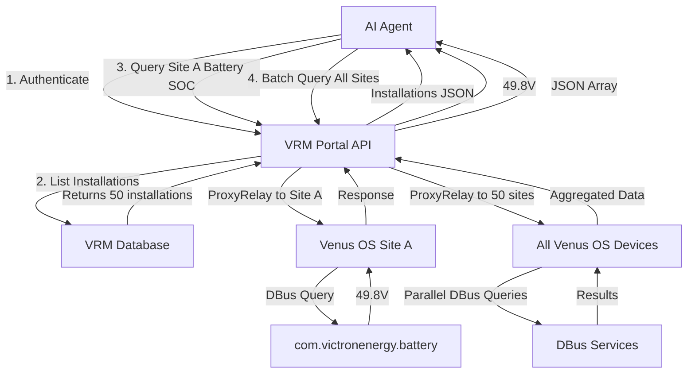
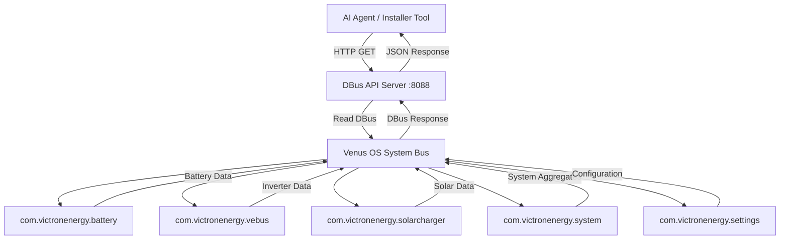

# Victron DBus API for AI Agents

[](https://github.com/vshymanskyy/StandWithUkraine/blob/main/docs/README.md)

[](LICENSE)
[](https://python.org)
[](https://github.com/victronenergy/venus)

> Read-only HTTP REST API server for Victron Venus OS devices, enabling AI agents to monitor and diagnose solar/battery systems at scale.

## What is This?

A Python-based HTTP API server that exposes Victron Venus OS (Cerbo GX, Venus GX) DBus system data via REST endpoints. Designed for **AI agents** and **fleet managers** to monitor multiple VRM installations remotely.

**Key Features:**
- 🔒 Read-only access (safe for production)
- 🚀 Lightweight (~200 lines Python, minimal dependencies)
- 📊 300+ diagnostic paths documented
- 🤖 AI-agent friendly JSON responses
- 🔌 Runs as daemon on Venus OS devices

---

## 🎯 Quick Start by Persona

Choose your path based on your role:

<table>
<tr>
<td width="50%">

### 🤖 **Mauk Muller** - AI Agent Developer
**Company**: El Niño (Victron AI ecosystem)
**Need**: Build AI agents to monitor VRM fleets

**Your Scenarios:**
1. [Diagnose battery issues across 50+ installations](#scenario-1-fleet-battery-health-monitoring)
2. [Detect solar production anomalies automatically](#scenario-2-solar-anomaly-detection)
3. [Predict maintenance needs before failures](#scenario-3-predictive-maintenance)

**[Start Here →](#for-ai-agent-developers-mauk-muller)**

</td>
<td width="50%">

### 🔧 **Victron Installer/Maintainer**
**Role**: System installer & troubleshooter
**Need**: Quick diagnostics and remote monitoring

**Your Scenarios:**
1. [Remote diagnosis without on-site visit](#scenario-4-remote-troubleshooting)
2. [Monitor system health in real-time](#scenario-5-installation-validation)
3. [Compare performance across installations](#scenario-6-system-comparison)

**[Start Here →](#for-victron-installers--maintainers)**

</td>
</tr>
</table>

---

## 📖 Table of Contents

- [Installation](#installation)
- [Quick Start](#quick-start)
- [Persona-Based Usage](#persona-based-usage)
  - [AI Agent Developers](#for-ai-agent-developers-mauk-muller)
  - [Victron Installers](#for-victron-installers--maintainers)
- [API Reference](#api-reference)
- [Research Documentation](#research-documentation)
- [VRM ProxyRelay Vision](#vrm-proxyrelay-integration-vision)
- [Architecture](#architecture)
- [Contributing](#contributing)

---

## Installation

### On Venus OS Device (Cerbo GX / Venus GX)

```bash
# 1. Copy server to device
scp dbus_api_server.py root@<DEVICE_IP>:~/

# 2. Start server
ssh root@<DEVICE_IP>
python3 dbus_api_server.py --port 8088 > dbus_api.log 2>&1 &

# 3. Verify
curl http://<DEVICE_IP>:8088/health
```

### Requirements

- Venus OS v2.9+ (tested on v3.70)
- Python 3.9+ (pre-installed on Venus OS)
- `dbus-python` (pre-installed)
- Network access to device

---

## Quick Start

### Test API Availability

```bash
# Check if server is running
curl http://192.168.88.77:8088/

# Response:
{
  "name": "Victron DBus API Server (Read-Only)",
  "version": "1.0.0",
  "mode": "read-only",
  "endpoints": { ... }
}
```

### Get System Overview

```bash
# List all services
curl http://192.168.88.77:8088/services | jq

# Get battery voltage
curl "http://192.168.88.77:8088/value?service=com.victronenergy.battery.socketcan_can0&path=/Dc/0/Voltage"

# Response:
{
  "service": "com.victronenergy.battery.socketcan_can0",
  "path": "/Dc/0/Voltage",
  "value": 49.79,
  "success": true
}
```

### Discover Devices

```bash
# Run discovery script
python3 discover_device_ids.py

# Outputs:
# - Device instances, product IDs, serial numbers
# - Firmware versions
# - Device topology
# - Exports to device_ids.json
```

---

## Persona-Based Usage

## For AI Agent Developers (Mauk Muller)

**Context**: You're building AI agents for El Niño to monitor Victron systems across multiple VRM installations. Your agents need to detect anomalies, predict failures, and optimize energy usage at scale.

### Scenario 1: Fleet Battery Health Monitoring

**Goal**: Monitor battery SOC, voltage, and health across 50+ installations.

**Implementation**:

```python
import requests
from typing import List, Dict

# List of your VRM installations with API servers
installations = [
    {"name": "Site A", "ip": "192.168.88.77"},
    {"name": "Site B", "ip": "192.168.88.189"},
    # ... 48 more sites
]

def check_battery_health(site: Dict) -> Dict:
    """Query battery metrics from one installation"""
    base_url = f"http://{site['ip']}:8088"

    battery_service = "com.victronenergy.battery.socketcan_can0"

    metrics = {}
    paths = {
        "soc": "/Soc",              # State of Charge (%)
        "voltage": "/Dc/0/Voltage",  # Voltage (V)
        "current": "/Dc/0/Current",  # Current (A)
        "soh": "/Soh",              # State of Health (%)
        "temp": "/Dc/0/Temperature"  # Temperature (°C)
    }

    for key, path in paths.items():
        response = requests.get(
            f"{base_url}/value",
            params={"service": battery_service, "path": path},
            timeout=2
        )
        if response.json().get("success"):
            metrics[key] = response.json()["value"]

    return {
        "site": site["name"],
        "metrics": metrics,
        "timestamp": datetime.now().isoformat()
    }

# Monitor all sites
for site in installations:
    health = check_battery_health(site)

    # AI Agent Detection Logic
    if health["metrics"]["soc"] < 20:
        alert("Low SOC", health)
    if health["metrics"]["soh"] < 80:
        alert("Battery Degradation", health)
    if health["metrics"]["temp"] > 50:
        alert("High Temperature", health)
```

**Diagnostic Paths Available**:
See [`VICTRON_DBUS_DIAGNOSTIC_API_RESEARCH.md`](VICTRON_DBUS_DIAGNOSTIC_API_RESEARCH.md) Section 2: Battery & Energy Storage (50+ paths).

**Anomaly Thresholds**:
See [`QUICK_REFERENCE_DIAGNOSTIC_PATHS.json`](QUICK_REFERENCE_DIAGNOSTIC_PATHS.json) for pre-configured AI detection rules.

---

### Scenario 2: Solar Anomaly Detection

**Goal**: Detect underperforming solar arrays by comparing production across installations with similar capacity.

**Implementation**:

```python
def check_solar_performance(site: Dict) -> Dict:
    """Compare solar production to expected values"""
    base_url = f"http://{site['ip']}:8088"

    # Get all solar chargers
    response = requests.get(f"{base_url}/services")
    services = response.json()["services"]
    solar_services = [s for s in services if "solarcharger" in s or "pvinverter" in s]

    total_power = 0
    chargers = []

    for service in solar_services:
        power = requests.get(
            f"{base_url}/value",
            params={"service": service, "path": "/Yield/Power"}
        ).json().get("value", 0)

        total_power += power
        chargers.append({"service": service, "power": power})

    return {
        "site": site["name"],
        "total_power": total_power,
        "chargers": chargers,
        "expected_power": site.get("rated_capacity"),  # From site config
        "performance_ratio": total_power / site.get("rated_capacity", 1)
    }

# AI Detection
for site in installations:
    performance = check_solar_performance(site)

    # Alert if production < 70% of expected
    if performance["performance_ratio"] < 0.7:
        investigate_solar_issue(site, performance)
```

**Documentation**:
- Multi-MPPT analysis: [`victron_einstein_research.md`](victron_einstein_research.md) Section 7
- Solar diagnostic paths: [`VICTRON_DBUS_DIAGNOSTIC_API_RESEARCH.md`](VICTRON_DBUS_DIAGNOSTIC_API_RESEARCH.md) Section 4

---

### Scenario 3: Predictive Maintenance

**Goal**: Predict component failures before they happen using trend analysis.

**Implementation**:

```python
from datetime import datetime, timedelta
import numpy as np

def collect_trend_data(site: Dict, days: int = 30) -> Dict:
    """Collect time-series data for trend analysis"""
    # In production, query from your time-series database
    # populated by periodic API polling

    metrics = {
        "battery_voltage": [],
        "battery_soh": [],
        "inverter_temp": [],
        "mppt_efficiency": []
    }

    # Query your historical database
    # ... (implementation depends on your DB choice)

    return metrics

def predict_failure_risk(site: Dict, trends: Dict) -> Dict:
    """AI model to predict failure probability"""

    risk_scores = {}

    # Battery voltage trending down?
    voltage_trend = np.polyfit(range(len(trends["battery_voltage"])),
                               trends["battery_voltage"], 1)[0]
    if voltage_trend < -0.01:  # Declining
        risk_scores["battery"] = "HIGH"

    # SOH degradation accelerating?
    soh_values = trends["battery_soh"]
    if len(soh_values) > 7:
        recent_drop = soh_values[-7] - soh_values[-1]
        if recent_drop > 2:  # Lost 2% in a week
            risk_scores["battery_replacement"] = "MEDIUM"

    # Inverter temp increasing?
    temp_trend = np.polyfit(range(len(trends["inverter_temp"])),
                            trends["inverter_temp"], 1)[0]
    if temp_trend > 0.5:  # Warming trend
        risk_scores["inverter_cooling"] = "MEDIUM"

    return risk_scores

# Schedule maintenance
for site in installations:
    trends = collect_trend_data(site, days=30)
    risks = predict_failure_risk(site, trends)

    if any(risk == "HIGH" for risk in risks.values()):
        schedule_maintenance(site, risks)
```

**Implementation Guide**:
See [`IMPLEMENTATION_GUIDE_AI_AGENTS.md`](IMPLEMENTATION_GUIDE_AI_AGENTS.md) for 8-week phased deployment:
- Phase 1: Real-time monitoring
- Phase 2: Historical data collection
- Phase 3: Anomaly detection
- Phase 4: Predictive analytics

---

### VRM ProxyRelay Integration Vision

**Context**: Currently, each Venus OS device needs the API server installed manually. **Vision**: Victron integrates this API into Venus OS core and enables VRM portal to proxy requests.

**Proposed Architecture**:



**Benefits for Mauk/El Niño**:

1. **No Manual Deployment**: API server built into Venus OS core
2. **VRM Authentication**: Use existing VRM API keys, no per-device setup
3. **Auto-Discovery**: VRM portal lists all user's installations automatically
4. **Caching**: VRM can cache frequent queries (e.g., battery SOC) for <1s response
5. **Batch Queries**: Single API call to query 50 sites in parallel
6. **NodeRED Integration**: ProxyRelay tech already proven with NodeRED

**Example API Flow**:

```python
import requests

VRM_API_KEY = "your_vrm_api_key"
VRM_API_BASE = "https://vrmapi.victronenergy.com"

# 1. List all installations (existing VRM API)
installations = requests.get(
    f"{VRM_API_BASE}/v2/users/<USER_ID>/installations",
    headers={"X-Authorization": f"Bearer {VRM_API_KEY}"}
).json()

# 2. Query via ProxyRelay (PROPOSED)
for install in installations["records"]:
    install_id = install["idSite"]

    # Query battery SOC via VRM proxy
    battery_soc = requests.get(
        f"{VRM_API_BASE}/v2/installations/{install_id}/dbus",
        params={
            "service": "com.victronenergy.battery.socketcan_can0",
            "path": "/Soc"
        },
        headers={"X-Authorization": f"Bearer {VRM_API_KEY}"}
    ).json()

    print(f"{install['name']}: {battery_soc['value']}%")
```

**Pitch to Victron**:
This repository demonstrates feasibility and AI agent demand. ProxyRelay infrastructure exists for NodeRED. Extending to REST API enables AI ecosystem (El Niño, etc.) to build on Victron platform.

---

## For Victron Installers & Maintainers

**Context**: You install and maintain Victron systems. You need quick diagnostics, remote troubleshooting, and performance validation without on-site visits.

### Scenario 4: Remote Troubleshooting

**Goal**: Customer reports "battery not charging" - diagnose remotely before dispatch.

**Quick Diagnostic Script**:

```bash
#!/bin/bash
# quick-diagnosis.sh

SITE_IP="$1"
API_BASE="http://${SITE_IP}:8088"

echo "=== Victron System Diagnosis ==="
echo "Site: ${SITE_IP}"
echo ""

# 1. Check system state
echo "System State:"
curl -s "${API_BASE}/value?service=com.victronenergy.system&path=/SystemState/State" | jq -r '.value'

# 2. Battery voltage and SOC
echo ""
echo "Battery:"
curl -s "${API_BASE}/value?service=com.victronenergy.battery.socketcan_can0&path=/Dc/0/Voltage" \
  | jq -r '"  Voltage: \(.value)V"'
curl -s "${API_BASE}/value?service=com.victronenergy.battery.socketcan_can0&path=/Soc" \
  | jq -r '"  SOC: \(.value)%"'

# 3. Inverter/charger state
echo ""
echo "Multi/Inverter:"
curl -s "${API_BASE}/value?service=com.victronenergy.vebus.ttyS4&path=/State" \
  | jq -r '"  State: \(.value) (3=Bulk, 4=Absorption, 5=Float)"'
curl -s "${API_BASE}/value?service=com.victronenergy.vebus.ttyS4&path=/Dc/0/Current" \
  | jq -r '"  Charge Current: \(.value)A"'

# 4. AC Input
echo ""
echo "AC Input:"
curl -s "${API_BASE}/value?service=com.victronenergy.vebus.ttyS4&path=/Ac/ActiveIn/L1/V" \
  | jq -r '"  Voltage: \(.value)V"'

# 5. Active alarms
echo ""
echo "Alarms:"
curl -s "${API_BASE}/settings" | jq -r '
  .settings | to_entries[]
  | select(.key | contains("Alarm"))
  | select(.value.Value == 2)
  | "  ⚠️  \(.key): ACTIVE"
'

echo ""
echo "=== Diagnosis Complete ==="
```

**Usage**:

```bash
chmod +x quick-diagnosis.sh
./quick-diagnosis.sh 192.168.88.77

# Output identifies issue in seconds:
#   Battery: 48.2V, 45% SOC
#   Multi State: 0 (Off)
#   AC Input: 0V  ← Problem! No grid power
# Conclusion: Grid outage, system on batteries. Not a fault.
```

---

### Scenario 5: Installation Validation

**Goal**: After installing a system, verify everything is working correctly before leaving site.

**Validation Checklist Script**:

```bash
#!/bin/bash
# validate-installation.sh

SITE_IP="$1"

echo "=== Installation Validation Checklist ==="

# Use Python validation script
python3 - <<EOF
import requests
import sys

base = "http://${SITE_IP}:8088"

def check(service, path, expected_range, name):
    try:
        r = requests.get(f"{base}/value", params={"service": service, "path": path}, timeout=2)
        val = r.json()["value"]
        min_val, max_val = expected_range
        status = "✅" if min_val <= val <= max_val else "❌"
        print(f"{status} {name}: {val}")
        return min_val <= val <= max_val
    except:
        print(f"❌ {name}: ERROR")
        return False

checks = [
    ("com.victronenergy.battery.socketcan_can0", "/Dc/0/Voltage", (48, 58), "Battery Voltage (48-58V)"),
    ("com.victronenergy.battery.socketcan_can0", "/Soc", (20, 100), "Battery SOC (>20%)"),
    ("com.victronenergy.vebus.ttyS4", "/Dc/0/Voltage", (47, 59), "Inverter DC Voltage"),
    ("com.victronenergy.vebus.ttyS4", "/Ac/Out/L1/V", (210, 240), "AC Output (210-240V)"),
    ("com.victronenergy.system", "/Dc/Battery/Temperature", (-10, 50), "Battery Temp (-10 to 50°C)"),
]

results = [check(*c) for c in checks]

print()
if all(results):
    print("🎉 Installation PASSED validation")
    sys.exit(0)
else:
    print("⚠️  Installation has ISSUES - review above")
    sys.exit(1)
EOF
```

---

### Scenario 6: System Comparison

**Goal**: Customer has 3 identical systems, one underperforming. Compare to find the issue.

**Comparison Script**:

```python
#!/usr/bin/env python3
# compare-systems.py

import requests
from tabulate import tabulate

sites = [
    {"name": "Site A", "ip": "192.168.88.77"},
    {"name": "Site B", "ip": "192.168.88.189"},
    {"name": "Site C", "ip": "192.168.88.200"}
]

def get_metrics(site):
    base = f"http://{site['ip']}:8088"
    battery_svc = "com.victronenergy.battery.socketcan_can0"

    def get(path):
        r = requests.get(f"{base}/value",
                        params={"service": battery_svc, "path": path},
                        timeout=2)
        return r.json().get("value", "N/A")

    return {
        "Site": site["name"],
        "SOC (%)": get("/Soc"),
        "Voltage (V)": get("/Dc/0/Voltage"),
        "Current (A)": get("/Dc/0/Current"),
        "Power (W)": get("/Dc/0/Power"),
        "SOH (%)": get("/Soh")
    }

# Collect and compare
data = [get_metrics(site) for site in sites]
print(tabulate(data, headers="keys", tablefmt="grid"))

# Output:
# +---------+----------+--------------+--------------+-----------+----------+
# | Site    | SOC (%)  | Voltage (V)  | Current (A)  | Power (W) | SOH (%)  |
# +=========+==========+==============+==============+===========+==========+
# | Site A  | 81.0     | 49.8         | -5.2         | -259      | 99       |
# | Site B  | 66.0     | 49.5         | -22.9        | -614      | 98       |
# | Site C  | 45.0     | 48.2         | -15.1        | -380      | 89       |  ← Low SOH!
# +---------+----------+--------------+--------------+-----------+----------+
# Site C has battery degradation (SOH 89% vs 98-99%). Schedule replacement.
```

**Documentation**:
- All comparison metrics: [`victron_einstein_metrics.md`](victron_einstein_metrics.md)
- Diagnostic thresholds: [`QUICK_REFERENCE_DIAGNOSTIC_PATHS.json`](QUICK_REFERENCE_DIAGNOSTIC_PATHS.json)

---

## API Reference

### Endpoints

| Method | Endpoint | Description |
|--------|----------|-------------|
| GET | `/` | API information and available endpoints |
| GET | `/health` | Health check |
| GET | `/services` | List all DBus services |
| GET | `/settings` | Get all settings from com.victronenergy.settings |
| GET | `/value?service=X&path=Y` | Get value from specific DBus path |
| GET | `/text?service=X&path=Y` | Get text representation of value |

### Common Services

| Service | Description |
|---------|-------------|
| `com.victronenergy.system` | System-level aggregated data |
| `com.victronenergy.battery.socketcan_can0` | Battery monitor (BMS) |
| `com.victronenergy.vebus.ttyS4` | Multi/Quattro inverter/charger |
| `com.victronenergy.solarcharger.*` | MPPT solar charge controllers |
| `com.victronenergy.pvinverter.*` | PV inverters |
| `com.victronenergy.settings` | System settings and configuration |

### Example Requests

```bash
# List all services
curl http://192.168.88.77:8088/services

# Get battery SOC
curl "http://192.168.88.77:8088/value?service=com.victronenergy.battery.socketcan_can0&path=/Soc"

# Get inverter state
curl "http://192.168.88.77:8088/value?service=com.victronenergy.vebus.ttyS4&path=/State"

# Get all settings (large response)
curl http://192.168.88.77:8088/settings > settings.json
```

### Response Format

**Success:**
```json
{
  "service": "com.victronenergy.battery.socketcan_can0",
  "path": "/Soc",
  "value": 81.0,
  "success": true
}
```

**Error:**
```json
{
  "error": "org.freedesktop.DBus.Error.UnknownObject: No such object path '/InvalidPath'",
  "success": false
}
```

---

## Research Documentation

### Core Documents

| Document | Size | Description |
|----------|------|-------------|
| [VICTRON_DBUS_DIAGNOSTIC_API_RESEARCH.md](VICTRON_DBUS_DIAGNOSTIC_API_RESEARCH.md) | 47KB | Complete diagnostic reference: 300+ DBus paths with anomaly thresholds for single-inverter systems |
| [victron_einstein_research.md](victron_einstein_research.md) | 38KB | Multi-device parallel system analysis: 2x inverters, 4x solar chargers, advanced BMS integration |
| [IMPLEMENTATION_GUIDE_AI_AGENTS.md](IMPLEMENTATION_GUIDE_AI_AGENTS.md) | 20KB | 8-week phased deployment roadmap with Python code examples for AI agent implementation |
| [QUICK_REFERENCE_DIAGNOSTIC_PATHS.json](QUICK_REFERENCE_DIAGNOSTIC_PATHS.json) | 14KB | Machine-readable configuration: 50+ critical paths, polling intervals, anomaly detection rules |

### Quick References

| Document | Purpose |
|----------|---------|
| [00_START_HERE.md](00_START_HERE.md) | Master navigation guide for all documentation |
| [victron_einstein_index.md](victron_einstein_index.md) | Quick reference index for multi-device systems |
| [victron_einstein_metrics.md](victron_einstein_metrics.md) | Operational monitoring metrics guide |

### Research Coverage

**Systems Analyzed:**

1. **System 1** (192.168.88.77) - Baseline Configuration
   - 1x MultiPlus-II 48/3000 inverter/charger
   - 1x Pylontech 8kWh battery
   - 1x Carlo Gavazzi EM24 energy meter
   - 2x Temperature sensors

2. **System 2 "einstein"** (192.168.88.189) - Complex Multi-Device
   - 2x Multi RS Solar 48V/6000VA (parallel operation)
   - 1x Lynx Smart BMS 500
   - 4x Solar charge controllers (11 MPPT trackers total)
   - 2x Energy meters (VE.Can + Modbus TCP)
   - 20 total services, 12 unique devices

**Diagnostic Capabilities Documented:**

- ✅ System health & firmware tracking (20+ paths)
- ✅ Battery diagnostics: SOC, SOH, cell voltages, BMS alarms (50+ paths)
- ✅ Multi-inverter parallel operation analysis (30+ paths)
- ✅ Solar production: Multi-MPPT performance, efficiency (40+ paths)
- ✅ Grid integration: 3-phase metering, power quality (25+ paths)
- ✅ ESS control & optimization (20+ paths)
- ✅ Alarms & notifications (30+ alarm types)
- ✅ Performance metrics & efficiency calculations

---

## VRM ProxyRelay Integration Vision

### Current State: Manual Deployment

```
AI Agent Developer (Mauk)
    ↓
Must SSH to each Venus device
    ↓
Install API server manually
    ↓
Manage 50+ IP addresses
    ↓
No centralized authentication
```

### Proposed State: VRM Integration

```
AI Agent Developer (Mauk)
    ↓
Authenticate with VRM API (once)
    ↓
Query all installations via VRM ProxyRelay
    ↓
VRM routes requests to Venus devices
    ↓
Responses cached in VRM for performance
```

### Technical Implementation (Proposed)

**Leverage Existing NodeRED ProxyRelay:**

Victron already implements ProxyRelay for NodeRED:
- NodeRED instances on Venus OS
- VRM portal proxies NodeRED UI access
- Authentication via VRM credentials
- Proven at scale across thousands of installations

**Extend to REST API:**

```python
# VRM API Extension (Proposed)
GET https://vrmapi.victronenergy.com/v2/installations/{installId}/dbus
    ?service=com.victronenergy.battery.socketcan_can0
    &path=/Soc

# VRM Backend (Proposed)
1. Validate VRM API token
2. Check user owns installation {installId}
3. ProxyRelay request to Venus device
4. Query DBus on device
5. Cache result (TTL: 5 seconds for real-time, 60s for settings)
6. Return JSON to AI agent

# Benefits:
- Uses existing VRM authentication
- Leverages proven ProxyRelay infrastructure
- Enables AI ecosystem on Victron platform
- No manual deployment needed
```

### Value Proposition for Victron

**For Victron:**
- Enables AI ecosystem (El Niño, others)
- Differentiates from competitors (Fronius, SMA)
- Revenue opportunity: VRM Pro tier for API access
- Aligns with Victron's open platform philosophy

**For AI Developers (Mauk/El Niño):**
- Zero-friction deployment
- Auto-discovery of installations
- Centralized authentication
- Production-ready from day one

**For Installers:**
- Professional AI-powered diagnostics
- Predictive maintenance
- Fleet management tools
- Better customer service

### Implementation Timeline (Proposed)

**Phase 1** (Q1 2026): Proof of Concept
- Integrate this API server into Venus OS core
- Enable on Venus OS beta firmware
- Test with El Niño AI agents

**Phase 2** (Q2 2026): VRM Integration
- Add ProxyRelay endpoints to VRM API
- Implement caching layer
- Beta test with select VRM users

**Phase 3** (Q3 2026): Production Launch
- Release to all VRM Pro users
- Document in VRM API docs
- Enable AI ecosystem partnerships

---

## Architecture

### System Diagram



### Components

| Component | Description | Technology |
|-----------|-------------|------------|
| **DBus API Server** | HTTP REST API exposing DBus data | Python 3, http.server, dbus-python |
| **Venus OS System Bus** | DBus message bus for inter-process communication | DBus (freedesktop.org) |
| **Victron Services** | Individual device drivers publishing to DBus | Python, C (varies by service) |
| **Discovery Scripts** | Device enumeration and diagnostics | Python 3, requests |

### Security Model

**Read-Only by Design:**
- All POST/PUT/DELETE requests return HTTP 403
- No `SetValue` method exposed
- No write operations to DBus
- Settings queries only (read-only)

**Network Security:**
- API server binds to 0.0.0.0:8088 (configurable)
- No authentication required (intended for trusted networks)
- For production: Use VPN or firewall rules to restrict access

---

## Scripts Reference

### Included Scripts

| Script | Purpose | Usage |
|--------|---------|-------|
| `dbus_api_server.py` | Main API server | `python3 dbus_api_server.py --port 8088` |
| `discover_device_ids.py` | Device discovery & topology | `python3 discover_device_ids.py` |
| `get_voltage_info.py` | Voltage monitoring (DC/AC) | `python3 get_voltage_info.py` |

### Example Workflows

**1. Initial System Discovery:**
```bash
# Deploy server
scp dbus_api_server.py root@192.168.88.77:~/
ssh root@192.168.88.77 "python3 dbus_api_server.py &"

# Discover devices
python3 discover_device_ids.py

# Output: device_ids.json with full topology
```

**2. Continuous Monitoring:**
```bash
# Run voltage monitoring every 10 seconds
watch -n 10 python3 get_voltage_info.py

# Or: Set up cron job for periodic collection
crontab -e
# Add: */5 * * * * python3 /path/to/get_voltage_info.py >> /var/log/victron_monitor.log
```

**3. AI Agent Integration:**
```python
# See persona scenarios above for complete examples
import requests

def poll_installation(ip: str):
    base = f"http://{ip}:8088"

    # Get battery SOC
    soc = requests.get(f"{base}/value",
                       params={"service": "com.victronenergy.battery.socketcan_can0",
                               "path": "/Soc"}).json()["value"]

    # Get solar power
    solar = requests.get(f"{base}/value",
                        params={"service": "com.victronenergy.solarcharger.socketcan_can0_vi5_uc431531",
                                "path": "/Yield/Power"}).json()["value"]

    return {"soc": soc, "solar_power": solar}
```

---

## Contributing

We welcome contributions from:
- AI agent developers building on Victron platform
- Victron installers with field experience
- Venus OS developers
- Community members with diagnostic expertise

### How to Contribute

1. **Report Issues**: Use GitHub Issues for bugs or feature requests
2. **Improve Documentation**: Fix typos, clarify scenarios, add examples
3. **Add Diagnostic Paths**: Contribute new DBus paths you've discovered
4. **Share Use Cases**: Document your AI agent or installer workflows

### Contribution Guidelines

- Follow existing documentation structure
- Test all code examples on real Venus OS devices
- Include persona context (Mauk or Installer scenarios)
- No Claude/AI credits in commits (per project policy)

---

## License

MIT License - See [LICENSE](LICENSE) file for details.

---

## Support & Community

- **GitHub Issues**: [victron_dbus_api/issues](https://github.com/EnergyCitizen/victron_dbus_api/issues)
- **Victron Community**: [community.victronenergy.com](https://community.victronenergy.com)
- **El Niño AI Ecosystem**: Contact Mauk Muller for AI agent collaboration

---

## Acknowledgments

- **Victron Energy**: For open platform and excellent documentation
- **El Niño Team**: For AI agent use case validation
- **Victron Community**: For field testing and feedback
- **ITCare Company**: For documentation template patterns

---

**Version**: 1.1.0
**Last Updated**: 2025-10-23
**Maintainers**: @podarok, EnergyCitizen team

---

<div align="center">

**Made in Ukraine 🇺🇦 with love by [EnergyCitizen](https://github.com/EnergyCitizen)**

</div>
